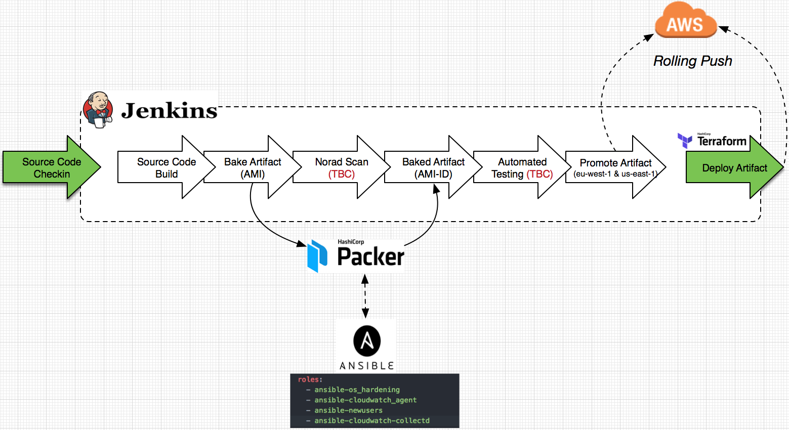
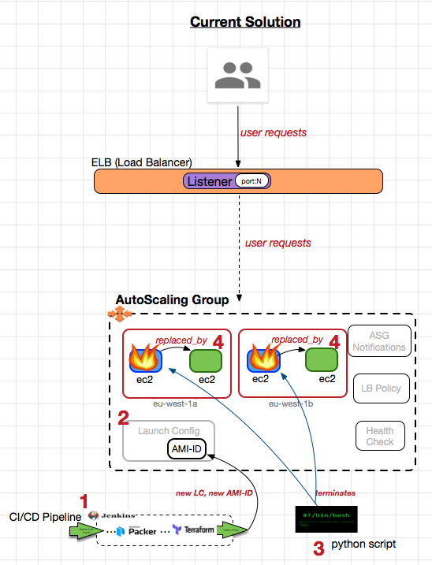
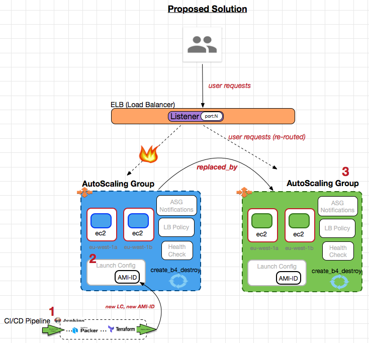

# CI/CD Pipeline for AMIs
Note: no automated testing.



## Deployment Pipeline (Current Method)




1. Jenkins Pipeline invokes Terraform which detects that a newer AMI exists. It deduces that this requires a change to the AMI-ID present in the LaunchConfig (LC).

2. LaunchConfigs are not modifiable so Terraform creates a new one.
Terraform recognises that the existing AutoScalingGroup (ASG) has a dependency on the old LC. Therefore, an update to the ASG is needed. Unlike LCs, ASGs are modifiable resources so the current ASG is simply updated with the new LaunchConfig.

3. The current (blue) ec2 instances have been booted from the AMI-ID contained in the old LC. To 'force' them to use the new AMI-ID in the new LC, they need to be terminated. A script cautiously terminates each ec2 instance on a one-by-one basis. Connection draining, by the ELB, ensures that any in-flight connections are completed before the blue instance is terminated.

4. The ASG triggers the creation of replacement (green) ec2 instances in response to terminations. The newly spun green instances are booted with the new AMI-ID.  Once the new 'green' instances pass a health-check they are deemed fit for service and new user requests will be routed to them by the ELB.


## Deployment Pipeline (Proposed Method)



The following happens when a new AMI is picked up by Terraform (invoked via Jenkins):

1. New LC is created in response to new AMI-ID.

2. Instead of modifying the ASG to use the new LaunchConfig, we trigger the creation of an entirely new ASG complete with ec2 instances (green). This occurs in parallel with the existing ASG (blue)

3. Once the ASG and associated ec2 instances have completed provisioning, they are recruited into service by the ELB.

4. Terraform destroys the blue ASG/LC/ec2 instances.


### In Detail:

Our AutoScalingGroup (ASG) has a dependency on the LaunchConfig. Recall that ASGs are modifiable so, ordinarily, the recreation of a LaunchConfig doesn't necessitate the recreation of the associated ASG. It can simply be modified (by Terraform).

However, we wish to enforce two things:
1. the creation of a new ASG in response to the creation of a new LaunchConfig
2. for this to happen in parallel with the existing ASG (thereby preventing any impact to user traffic)

We achieve this by implementing the following in Terraform for each of the ASG and LaunchConfig resources:

```
lifecycle {
    create_before_destroy = true
  }

```
This overrides the default Terraform behaviour of destroying resources before creating them.

Instead of using a 'name' attribute in our LC configuration, we use:

```
name_prefix = "${terraform.env}-webserver_LC-"
```
which results in an auto-generated name for the LaunchConfig, e.g:
```
dev-cicd-poc-webserver_LC-20180528141822578200000001
```
which means that every time we ship a new AMI, we'll create a new (uniquely named) LC.

Further to this, our ASG interpolates the LC name into its own name. This forces a replacement ASG to be created each time a new LC is created (instead of the ASG being updated).

```
  name = "${terraform.env}-WEBSERVER-ASG-${aws_launch_configuration.launch_config.name}"
```

In the ASG definition, we specify:

```
min_size = "2"
```

Terraform's default behaviour is to wait for 'min_size' healthy instances to appear before proceeding. Hence, this ASG will only be recruited into service as soon as the ec2 instances are ready to process user requests.
[Other toggles and parameters are also available.]( https://www.terraform.io/docs/providers/aws/r/autoscaling_group.html#waiting-for-capacity)


## Testing
The [slapper](https://github.com/ikruglov/slapper) load-testing tool was used to observe whether any user-impacting events occurred while the ELB transitioned over to the new green ASG. 50 x GET requests per second were used against our webserver under test. No non-200s were observed.


# Future/Todo:

For unit/integration testing, consider another approach: use a resource provisioner to perform an application health check. TF won't declare the resource as created until provisioner completes: the provisioner delays deletion of old resource until new resource has been created & is capable of serving requests.
